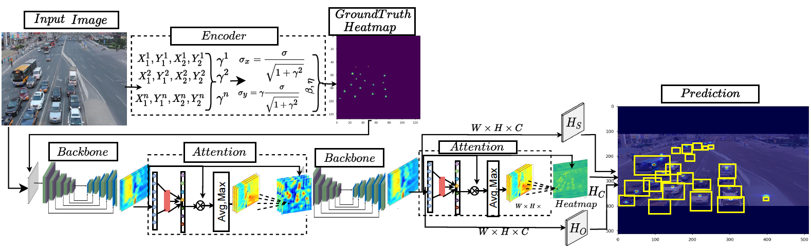

   
   
# TriPosNet
#### Repository for the paper : "TriPosNet : Attention Based Keypoint Anchor-free Small-object Detection Framework"
#### The code will be available upon acceptance of the paper. 
## Abstract
Most object detection research focuses on identifying a large object covering a substantial part of the image, while small object detection is often overlooked. Small objects are difficult to detect since they contain few pixels and cover a small portion of the picture. We propose TriPoslNet, a key-point based object detection framework that employs a novel key-point encoder and attention mechanism to enhance the small object detection performance. The key-point encoder addresses the representational imbalance between small and big objects by effectively encoding object information in a heatmap representation. The attention mechanism enables the detector to adaptively change the receptive field in order to capture and emphasize small object features on low-resolution representation of the extracted features. To further improve the performance, we developed a fusion module to combine predictions from several output levels of the backbone architecture. Using our suggested method, we achieve state-of-the-art performance on both the UDETRAC and the UAVDT benchmark dataset, which consists primarily of small objects. For further information, visit.

## Model

# Results

### Results on UA-DETRAC
- Prediction result from the trianed TriPosNet model is avaialble under : Prediction_result/UA-DETRAC 
- The summrized result is presented as follows

| Model                                      | Overall          | Easy             | Medium           | Hard             | Cloudy           | Night            | Rainy            | Sunny            |
|--------------------------------------------|------------------|------------------|------------------|------------------|------------------|------------------|------------------|------------------|
| TriPosNet (ours)                             | 88.43% | 97.83% | 93.12% | 79.81% | 91.37% | 90.29% | 83.24% | 91.32% |
| SpotNet                           | 86.80% | 97.58% | 92.57% | 76.58% | 89.38% | 89.53% | 80.93% | 91.42% |
| CenterNet | 83.48%          | 96.50%          | 90.15%          | 71.46%          | 85.01%          | 88.82%          | 77.78%          | 88.73%          |
| FG-BR\_Net         | 79.96%          | 93.49%          | 83.60%          | 70.78%          | 87.36%          | 78.42%          | 70.50%          | 89.8%           |
| HAT            | 78.64%          | 93.44%          | 83.09%          | 68.04%          | 86.27%          | 78.00%          | 67.97%          | 88.78%          |
| GP-FRCNNm         | 77.96%          | 92.74%          | 82.39%          | 67.22%          | 83.23%          | 77.75%          | 70.17%          | 86.56%          |
| R-FCN           | 69.87%          | 93.32%          | 75.67%          | 54.31%          | 74.38%          | 75.09%          | 56.21%          | 84.08%          |
| EB            | 67.96%          | 89.65%          | 73.12%          | 53.64%          | 72.42%          | 73.93%          | 53.40%          | 83.73%          |
| Faster R-CNN          | 58.45%          | 82.75%          | 63.05%          | 44.25%          | 66.29%          | 69.85%          | 45.16%          | 62.34%          |
| YOLOv2       | 57.72%          | 83.28%          | 62.25%          | 42.44%          | 57.97%          | 64.53%          | 47.84%          | 69.75%          |
| RN-D              | 54.69%          | 80.98%          | 59.13%          | 39.23%          | 59.88%          | 54.62%          | 41.11%          | 77.53%          |
| 3D-DETnet       | 53.30%          | 66.66%          | 59.26%          | 43.22%          | 63.30%          | 52.90%          | 44.27%          | 71.26%          |
